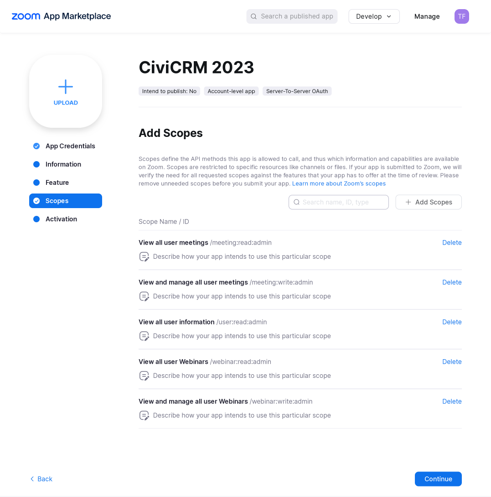
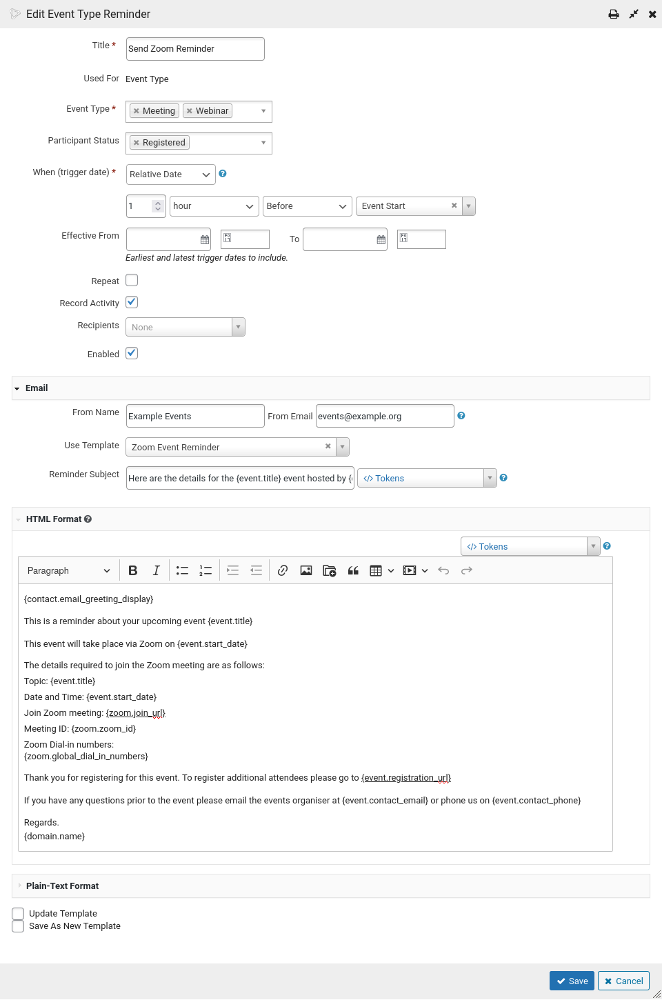

# Zoom Zoom (au.com.agileware.zoomzoom)

This is just another [CiviCRM](https://civicrm.org) extension which integrates with
[Zoom](https://zoom.us). Provides the following features:

* CiviRule to create Zoom Webinar from Event and create Zoom Meeting from Event
* CiviRule to update Zoom details
* CiviRule to delete a Zoom
* CiviRule to add an Event Participant to a Zoom
* CiviRule to delete a Participant from a Zoom
* Scheduled Job to import Zoom Webinars and Zoom Events as CiviCRM
  Events
* Scheduled Job to check CiviCRM Events linked to Zoom and import the
  Zoom registrations, attendees and absentees. Record as CiviCRM
  Participants and update Participant Status.

The extension is licensed under [AGPL-3.0](LICENSE.txt).

## Migrating from a JWT App

JWT Apps are deprecated on Zoom, so to ensure continued function this app has been converted to use
OAuth Server-to-Server. Existing installations configured to use a JWT App will need to create
and connect to a new app according to the instructions in the [Getting Started](#getting-started) 
section below.

## Getting Started

1. Zoom OAuth Server-to-Server credentials are required for this Integration. Create an OAuth
   Server-to-Server App in the [Zoom Marketplace](https://marketplace.zoom.us/develop/create).
   1. Fill in the App Details
   2. Move through to the Scopes tab and ensure that the App has the appropriate scope permissions:
	  * **View all user meetings** /meeting:read:admin, meeting:read:past_meeting:admin, meeting:read:meeting:admin, meeting:read:list_past_participants:admin, meeting:read:list_past_instances:admin, meeting:read:registrant:admin, meeting:read:list_registrants:admin, meeting:read:participant:admin
	  * **View and manage all user meetings** /meeting:write:admin, meeting:write:registrant:admin, meeting:update:meeting:admin, meeting:delete:meeting:admin, meeting:write:meeting:admin, meeting:delete:registrant:admin
	  * **View all user information** /user:read:admin, user:read:list_users:admin, user:read:user:admin
	  * **View all user Webinars** /webinar:read:admin, webinar:read:list_past_instances:admin, webinar:read:list_absentees:admin, webinar:read:webinar:admin, webinar:read:list_past_participants:admin, webinar:read:participant:admin, webinar:read:registrant:admin, webinar:read:list_registrants:admin
	  * **View and manage all user Webinars** /webinar:write:admin, webinar:delete:registrant:admin, webinar:update:webinar:admin, webinar:delete:webinar:admin, webinar:write:webinar:admin, webinar:write:registrant:admin
	  
   3. Continue to Activation and Activate your app
   4. Load the App Credentials tab to get the **Account ID**, **Client ID** and **Client Secret**
2. In CiviCRM, go to the Zoom Settings page, Administer / Zoom Settings.
   * Insert the **Account ID**, **Client ID** and **Client Secret** from above.
   * Set the other options on the Zoom Settings page, as required.
3. The following **Scheduled Jobs** are provided:
   * **Import Zoom Webinars and Meetings** - Enable this Scheduled Job if you want to create CiviCRM
     Events from Zooms. Specify a day offset to process _Zooms_ with a start date either in the last
     X days (by providing a negative number) or from a future date. The default day_offset is -90
     which will process Zooms with a start date in the last 90 days.
   * **Import Zoom Registrations, Attendees, Absentees** - Enable this Scheduled Job if you want to
     create CiviCRM Participant records in CiviCRM from Zoom registrations, attendance and
     absentees. This job will only process CiviCRM Events which are linked to a Zoom. Specify a day
     offset to process _Events_ with a start date either in the last X days (by providing a negative
     number) or from a future date. The default day_offset is -90 which will process Events with a
     start date in the last 90 days. _Note: As this Scheduled Job checks CiviCRM Events linked to a
     Zoom, it is a good idea to run this job **after** the **Import Zoom Webinars and Meetings**
     job_.

## Import Configuration Defaults

Zoom Zoom is provided with optional configuration sets that can be imported using a third party
extension, [CiviCRM Configuration Loader (configitems)](https://lab.civicrm.org/extensions/configitems).
To use these configuration sets:

1. Install the [configitems](https://lab.civicrm.org/extensions/configitems) extension
2. Go to "Administer / System Setings / Manage configuration sets" in CiviCRM
3. Press the **Import Configuration** button:
4. To install default CiviRules rulesets, use
   [zoom_zoom_default_rules-v1.zip](optional/zoom_zoom_default_rules-v1.zip)
5. To install the sample schedule reminder message template, use
   [zoom_zoom_schedule_reminder-v1.zip](optional/zoom_zoom_schedule_reminder-v1.zip)
6. You can then create a schedule reminder from "Administer / Communications / Schedule Reminders":
7. Press the **Add Reminder** button
8. For the **Used For** field, select *Event Type*
9. Your **Event Type** field should be *Meeting* and *Webinar* for the default setup, or use the
   event types you have configured for the **Zoom Meeting, Event Type** and **Zoom Webinar, Event
   Type** in the extension configuration at "Administer / Zoom Settings"
10. For **Participant Status**, select *Registered*
11. Fill out the rest of the basic fields as required
12. Under **Email**: **Use Template**, select *Zoom Event Reminder*
13. The HTML Format field will the have the imported template inserted into it, ready to be
   customised.



## Credits and acknowledgements

Credit to Lighthouse Consulting and Design, Inc for developing
[https://github.com/lcdservices/biz.lcdservices.civizoom](https://github.com/lcdservices/biz.lcdservices.civizoom)
which was used as the basis for this new extension.  Credit to Veda Consulting for developing
[https://github.com/veda-consulting-company/ncn-civi-zoom](https://github.com/veda-consulting-company/ncn-civi-zoom)
which was used as reference for the CiviRules implementation.

## Requirements

* PHP v7.4+
* CiviCRM 5.37+

## Installation (Web UI)

Learn more about installing CiviCRM extensions in the [CiviCRM Sysadmin
Guide](https://docs.civicrm.org/sysadmin/en/latest/customize/extensions/).

## Installation (CLI, Zip)

Sysadmins and developers may download the `.zip` file for this extension and install it with the
command-line tool [cv](https://github.com/civicrm/cv).

```bash
cd <extension-dir>
cv dl au.com.agileware.zoomzoom@https://github.com/agileware/au.com.agileware.zoomzoom/archive/master.zip
```

## Installation (CLI, Git)

Sysadmins and developers may clone the [Git](https://en.wikipedia.org/wiki/Git) repo for this
extension and install it with the command-line tool [cv](https://github.com/civicrm/cv).

```bash
git clone https://github.com/agileware/au.com.agileware.zoomzoom.git
cv en zoomzoom
```

# About the Authors

This CiviCRM extension was developed by the team at
[Agileware](https://agileware.com.au).

[Agileware](https://agileware.com.au) provide a range of CiviCRM
services including:

* CiviCRM migration
* CiviCRM integration
* CiviCRM extension development
* CiviCRM support
* CiviCRM hosting
* CiviCRM remote training services

Support your Australian [CiviCRM](https://civicrm.org) developers,
[contact Agileware](https://agileware.com.au/contact) today!


